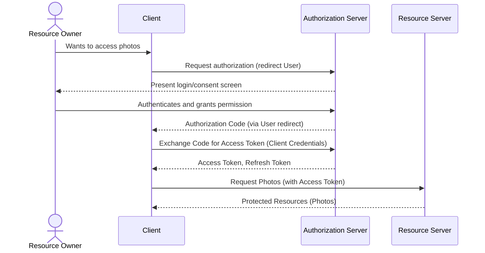

## Overview

OAuth 2.0 (Open Authorization) is an open standard designed for **authorization**, enabling a third-party application (the "client") to obtain limited access to a user's resources (e.g., data, APIs) hosted by another service (the "resource server"), without ever exposing the user's primary login credentials (username and password) to the client application. It acts as a delegated authorization framework, using access tokens to grant specific, time-limited permissions. While fundamentally an authorization protocol, it often serves as the foundation for authentication layers like OpenID Connect (OIDC).

A significant evolution, **OAuth 2.1**, has recently emerged to consolidate security best practices and deprecate less secure flows. Key changes include making Proof Key for Code Exchange (PKCE) mandatory for all authorization code flows, removing the implicit grant and the resource owner password credentials grant, and formalizing secure refresh token handling for single-page applications (SPAs).

### Problem Solved

Before OAuth2, if a third-party application needed to access a user's data on another service (e.g., a photo editing app wanting access to Google Photos), it would often require the user to input their username and password directly into the third-party app. This practice posed significant security risks:

*   **Credential Exposure:** The user's sensitive login credentials would be exposed to and stored by the third-party app, which could then gain full, unrestricted access to the user's account.
*   **Lack of Granularity:** Users had no control over what specific data or actions the third-party app could perform; it was all or nothing.
*   **Revocation Issues:** Revoking access often meant changing the primary password, which was inconvenient and impacted all other connected applications.

OAuth2 solves these issues by allowing users to grant **secure, delegated, and limited access** through a trusted intermediary (the authorization server), issuing short-lived "access tokens" with specific "scopes" of permission. The third-party app never sees the user's password.

### Alternatives and Related Technologies

While OAuth2 is the de facto standard for delegated authorization, several other protocols and approaches exist:

*   **OAuth 1.0:** The predecessor to OAuth 2.0, it was replaced in 2012 due to its greater complexity in implementation, particularly its reliance on cryptographic signatures for every request.
*   **OpenID Connect (OIDC):** Built on top of OAuth 2.0, OIDC adds an identity layer for user authentication. While OAuth2 handles *what* an application can access, OIDC addresses *who* the user is, enabling Single Sign-On (SSO) scenarios. It's a complement, not an alternative, to OAuth2's core authorization function.
*   **SAML (Security Assertion Markup Language):** An XML-based framework primarily used for enterprise-level Single Sign-On (SSO) in business-to-business (B2B) environments. It's often more complex to implement than OAuth2/OIDC but integrates well with existing identity management systems.
*   **JSON Web Tokens (JWT):** A compact, URL-safe format for securely transmitting claims between parties. JWTs are commonly used *as* access tokens or identity tokens within OAuth2 and OIDC, rather than being an alternative to the entire authorization framework.
*   **Mutual TLS (mTLS):** Provides strong mutual authentication where both the client and server present certificates to each other. It adds an extra layer of security, often used in highly sensitive systems.

### Primary Use Cases

OAuth2 underpins many common interactions in the modern digital landscape:

*   **Third-Party Application Integration:** The most common use case, allowing apps (e.g., a budgeting app) to access specific data from other services (e.g., banking transactions) without needing the user's direct login credentials for the bank.
*   **"Login with X" (Social Logins):** Users can sign into new websites or applications using their existing accounts from major providers like Google, Facebook, or GitHub, simplifying the onboarding process and enhancing user convenience.
*   **API Authorization:** Securing access to Application Programming Interfaces (APIs), enabling clients to consume protected resources on behalf of a user or even machine-to-machine communication.
*   **Mobile and Native Applications:** Providing secure delegated access for applications running on smartphones, tablets, or desktop environments, using specialized grant types like Authorization Code with PKCE.
*   **Internet of Things (IoT) Devices:** Enabling smart devices (e.g., thermostats, security cameras) to securely communicate with cloud platforms and other services.

## Technical Details

OAuth 2.0 and its evolution to OAuth 2.1 provide a robust framework for delegated authorization. This section details its core components and modern implementation practices.

### 1. Roles: Resource Owner, Client, Authorization Server, Resource Server

Understanding the distinct actors is fundamental to grasping OAuth2's flow.

*   **Resource Owner:** The entity (typically a user) who owns the protected resources and can grant access to them. For example, you are the resource owner of your Google Photos.
*   **Client (Application):** The application requesting access to the resource owner's protected resources. This could be a web application, a mobile app, or even another server. It acts on behalf of the resource owner.
*   **Authorization Server (AuthZ Server):** The server that authenticates the resource owner, obtains their authorization, and issues access tokens to the client. It's the central point for managing permissions.
*   **Resource Server (AuthN Server):** The server hosting the protected resources (e.g., an API) and capable of accepting and responding to protected resource requests using access tokens.



**Best Practices:**
*   **Clear Separation of Concerns:** Ensure your Authorization Server focuses solely on authentication, authorization, and token issuance, while the Resource Server focuses on serving protected resources.
*   **Secure Communication:** All communication between these roles, especially involving credentials or tokens, must use TLS/SSL (HTTPS).
*   **Client Registration:** Clients must be securely registered with the Authorization Server, typically receiving a `client_id` and `client_secret` (for confidential clients).

**Common Pitfalls:**
*   **Confusing Roles:** Misunderstanding which server does what can lead to security vulnerabilities or incorrect implementations.
*   **Sharing Client Secrets:** Treating a `client_secret` carelessly (e.g., exposing it in client-side code) compromises the client's identity.

### 2. Authorization Grant Types (Flows)

Authorization Grant Types define the methods a client can use to obtain an access token. OAuth 2.1 has significantly refined these to improve security.

*   **Authorization Code Grant with PKCE (Proof Key for Code Exchange):** This is the **most secure and recommended grant type** for almost all client types, including confidential clients (web servers) and public clients (SPAs, mobile, native apps). It involves a redirect to the Authorization Server, which returns a temporary `authorization_code`. The client then exchanges this code for an `access_token` and `refresh_token` at the Authorization Server's token endpoint, proving its identity (and PKCE for public clients).

    **Step 1: Authorization Request (Client redirects user to AuthZ Server)**
    ```
    GET https://authorization-server.com/oauth/authorize?
        response_type=code&
        client_id=YOUR_CLIENT_ID&
        redirect_uri=https://your-app.com/callback&
        scope=openid%20profile%20email&
        state=RANDOM_STRING_FOR_CSRF&
        code_challenge=YOUR_PKCE_CHALLENGE&  // PKCE
        code_challenge_method=S256         // PKCE
    ```

    **Step 2: Token Exchange Request (Client sends request to AuthZ Server's token endpoint)**
    ```http
    POST https://authorization-server.com/oauth/token
    Content-Type: application/x-www-form-urlencoded

    grant_type=authorization_code&
    client_id=YOUR_CLIENT_ID&
    redirect_uri=https://your-app.com/callback&
    code=AUTHORIZATION_CODE_RECEIVED&
    code_verifier=YOUR_PKCE_VERIFIER  // PKCE
    // For confidential clients, add client_secret or use Basic Auth:
    // client_secret=YOUR_CLIENT_SECRET
    ```

*   **Client Credentials Grant:** Used for machine-to-machine communication where a client application needs to access protected resources it controls, rather than a user's resources. The client authenticates directly with the Authorization Server using its `client_id` and `client_secret` to obtain an `access_token`.

**Deprecated Flows (Removed in OAuth 2.1):**
*   **Implicit Grant Flow:** Removed due to its inherent security vulnerabilities, such as token leakage through browser history or referral headers. SPAs are now recommended to use the Authorization Code flow with PKCE.
*   **Resource Owner Password Credentials (ROPC) Grant:** Deprecated due to poor security practices as it required applications to directly handle user credentials.

**Best Practices:**
*   **Always use Authorization Code Grant with PKCE:** OAuth 2.1 makes PKCE mandatory for all authorization code flows, eliminating the need for `implicit` and `resource owner password credentials` grants. This protects against authorization code interception attacks.
*   **Use Client Credentials for M2M:** Reserve the Client Credentials flow for non-user-specific, server-to-server interactions.
*   **Secure Client Secrets:** For confidential clients (e.g., backend web apps), store `client_secret` securely (environment variables, secret management services) and never expose them in client-side code.

**Common Pitfalls:**
*   **Using Deprecated Flows:** Relying on the `implicit grant` or `resource owner password credentials (ROPASS)` grants, which are now deprecated due to significant security vulnerabilities.
*   **Not Implementing PKCE:** Forgetting PKCE leaves your authorization code flow vulnerable to interception attacks, especially for public clients.

#### Real-World Implementation Examples:

**Helper function for PKCE generation:**

**Python `pkce_utils.py`:**
```python
import os
import base64
import hashlib

def generate_pkce_pair():
    """Generates a PKCE code_verifier and code_challenge."""
    # Generate a cryptographically random string for the code_verifier
    verifier = base64.urlsafe_b64encode(os.urandom(32)).rstrip(b'=').decode('ascii')
    # Hash the verifier and base64url-encode it for the code_challenge
    challenge = base64.urlsafe_b64encode(
        hashlib.sha256(verifier.encode('ascii')).digest()
    ).rstrip(b'=').decode('ascii')
    return verifier, challenge
```

**Node.js `pkceUtils.js`:**
```javascript
const crypto = require('crypto');

function base64URLEncode(str) {
    return str.toString('base64')
        .replace(/\+/g, '-')
        .replace(/\//g, '_')
        .replace(/=/g, '');
}

function sha256(buffer) {
    return crypto.createHash('sha256').update(buffer).digest();
}

function generatePkcePair() {
    const verifier = base64URLEncode(crypto.randomBytes(32));
    const challenge = base64URLEncode(sha256(verifier));
    return { verifier, challenge };
}

module.exports = { generatePkcePair };
```

**Authorization Code Grant with PKCE (Python Flask Example):**
This example simulates a confidential web application (backend Python server) handling the OAuth flow.

```python
# app.py (using Flask for simplicity)
import os
import requests
import json
from flask import Flask, redirect, url_for, session, request
from pkce_utils import generate_pkce_pair # Our PKCE helper

app = Flask(__name__)
app.secret_key = os.urandom(24) # Used for Flask session management

# --- Configuration (Replace with your actual values) ---
AUTH_SERVER_URL = "https://your-auth-server.com/oauth" # E.g., Auth0, Keycloak
CLIENT_ID = os.environ.get("OAUTH_CLIENT_ID", "your_client_id")
CLIENT_SECRET = os.environ.get("OAUTH_CLIENT_SECRET", "your_client_secret") # For confidential clients
REDIRECT_URI = "http://localhost:5000/callback"
SCOPE = "openid profile email photos.read" # Requesting OIDC scopes and a custom API scope

@app.route("/")
def index():
    if "user_info" in session:
        return f"Hello, {session['user_info'].get('name')}! <a href='/logout'>Logout</a><br><pre>{json.dumps(session.get('user_info'), indent=2)}</pre>"
    return "<a href='/login'>Login with OAuth2</a>"

@app.route("/login")
def login():
    verifier, challenge = generate_pkce_pair()
    session['pkce_verifier'] = verifier # Store verifier in session for later
    
    state = base64.urlsafe_b64encode(os.urandom(16)).rstrip(b'=').decode('ascii')
    session['oauth_state'] = state # Store state for CSRF protection

    auth_url = (
        f"{AUTH_SERVER_URL}/authorize?"
        f"response_type=code&"
        f"client_id={CLIENT_ID}&"
        f"redirect_uri={REDIRECT_URI}&"
        f"scope={SCOPE}&"
        f"state={state}&"
        f"code_challenge={challenge}&"
        f"code_challenge_method=S256"
    )
    return redirect(auth_url)

@app.route("/callback")
def callback():
    # 1. Validate state parameter to prevent CSRF
    if request.args.get("state") != session.pop("oauth_state", None):
        return "Invalid state parameter", 400

    auth_code = request.args.get("code")
    if not auth_code:
        return f"Error: {request.args.get('error')} - {request.args.get('error_description')}", 400

    # 2. Exchange authorization code for tokens
    token_endpoint = f"{AUTH_SERVER_URL}/token"
    headers = {
        "Content-Type": "application/x-www-form-urlencoded"
    }
    # Client authentication for confidential client (using Basic Auth is also common)
    data = {
        "grant_type": "authorization_code",
        "client_id": CLIENT_ID,
        "client_secret": CLIENT_SECRET, # Sent only by confidential clients
        "redirect_uri": REDIRECT_URI,
        "code": auth_code,
        "code_verifier": session.pop("pkce_verifier") # PKCE verifier
    }

    try:
        response = requests.post(token_endpoint, headers=headers, data=data)
        response.raise_for_status() # Raise an exception for HTTP errors (4xx or 5xx)
        token_data = response.json()
        
        session['access_token'] = token_data.get('access_token')
        session['refresh_token'] = token_data.get('refresh_token')
        session['id_token'] = token_data.get('id_token') # For OIDC
        session['expires_in'] = token_data.get('expires_in')

        # Optionally decode ID Token for user info (requires validation, see OIDC section)
        if session.get('id_token'):
            import jwt # pip install PyJWT
            # This is a basic decode, proper validation is critical in production
            # For a real app, use a library like Authlib to validate issuer, audience, signature, etc.
            try:
                decoded_id_token = jwt.decode(session['id_token'], options={"verify_signature": False})
                session['user_info'] = decoded_id_token
            except Exception as e:
                app.logger.error(f"Failed to decode ID Token: {e}")
                session['user_info'] = {"error": "Failed to decode ID Token"}

        return redirect(url_for("index"))

    except requests.exceptions.RequestException as e:
        app.logger.error(f"Token exchange failed: {e}")
        return f"Token exchange failed: {e}", 500

@app.route("/logout")
def logout():
    session.clear()
    return redirect(url_for("index"))

if __name__ == "__main__":
    # Ensure CLIENT_ID and CLIENT_SECRET are set in environment variables
    # or replace the os.environ.get calls with direct strings for testing (not recommended for production)
    if not CLIENT_ID or (not CLIENT_SECRET and "your-auth-server.com" not in AUTH_SERVER_URL): # only if not a public client
         print("WARNING: CLIENT_ID or CLIENT_SECRET not set. Using placeholders. Set environment variables OAUTH_CLIENT_ID, OAUTH_CLIENT_SECRET")
         print("For public clients (SPAs/Mobile), CLIENT_SECRET is not used.")

    app.run(debug=True)
```

**Client Credentials Grant (Python Example):**
```python
import os
import requests
import json # Added for pretty printing

# --- Configuration ---
AUTH_SERVER_URL = "https://your-auth-server.com/oauth"
CLIENT_ID = os.environ.get("M2M_CLIENT_ID", "your_m2m_client_id")
CLIENT_SECRET = os.environ.get("M2M_CLIENT_SECRET", "your_m2m_client_secret")
SCOPE = "api.read api.write" # Scopes relevant to the application itself

def get_m2m_access_token():
    """Obtains an access token using the Client Credentials Grant."""
    token_endpoint = f"{AUTH_SERVER_URL}/token"
    headers = {
        "Content-Type": "application/x-www-form-urlencoded"
    }
    data = {
        "grant_type": "client_credentials",
        "client_id": CLIENT_ID,
        "client_secret": CLIENT_SECRET,
        "scope": SCOPE
    }

    try:
        response = requests.post(token_endpoint, headers=headers, data=data)
        response.raise_for_status()
        token_data = response.json()
        print("Successfully obtained M2M Access Token:")
        print(json.dumps(token_data, indent=2))
        return token_data.get("access_token")
    except requests.exceptions.RequestException as e:
        print(f"Error obtaining M2M Access Token: {e}")
        return None

if __name__ == "__main__":
    if not CLIENT_ID or not CLIENT_SECRET:
        print("WARNING: M2M_CLIENT_ID or M2M_CLIENT_SECRET not set. Please set environment variables.")
    
    access_token = get_m2m_access_token()
    if access_token:
        # Now use this access_token to call your own protected API
        print(f"\nUsing M2M Access Token: {access_token[:20]}...")
        # Example: call to an internal API
        # api_response = requests.get("https://your-internal-api.com/data", headers={"Authorization": f"Bearer {access_token}"})
        # print(api_response.json())
```

### 3. Access Tokens & Refresh Tokens

These are the credentials issued by the Authorization Server, central to granting and maintaining access.

*   **Access Token:** A credential that grants the client application access to specific protected resources on behalf of the resource owner. It is typically a short-lived, opaque string or a JWT (JSON Web Token) that the Resource Server validates.
*   **Refresh Token:** A credential used by the client to obtain a new access token when the current one expires, without requiring the resource owner to re-authenticate. Refresh tokens are typically long-lived and must be treated with extreme care.

```json
// Example response from Authorization Server's token endpoint
{
  "access_token": "eyJhbGciOiJIUzI1Ni...", // JWT or opaque string
  "token_type": "Bearer",
  "expires_in": 3600, // seconds until expiration (1 hour)
  "refresh_token": "MzVjZDk3YTQ0OGM0ZmRh...", // Long-lived, opaque string
  "scope": "openid profile email"
}
```

**Best Practices:**
*   **Short-Lived Access Tokens:** Keep access tokens short-lived (e.g., 5-60 minutes) to minimize the impact of compromise.
*   **Secure Refresh Token Storage:** Refresh tokens must be stored very securely. For web applications, use HTTP-only, secure cookies. For mobile/native apps, use secure storage mechanisms provided by the OS (e.g., Android Keystore, iOS Keychain).
*   **Rotate Refresh Tokens:** Consider refresh token rotation, where a new refresh token is issued with each access token refresh, and the old one is immediately invalidated.
*   **Validate Access Tokens:** Resource Servers must validate every incoming access token (signature, expiration, issuer, audience, scope) before granting access.
*   **Token Revocation:** Implement mechanisms to revoke access and refresh tokens, especially upon logout or security events.

**Common Pitfalls:**
*   **Long-Lived Access Tokens:** Makes compromised tokens more dangerous.
*   **Insecure Refresh Token Handling:** Storing refresh tokens in local storage (web) or insecure plaintext (mobile) is a major vulnerability.
*   **Not Validating Tokens:** Resource Servers failing to properly validate access tokens can lead to unauthorized access.

#### Resource Server Access Token Validation (Node.js Example):
This example shows a simple Node.js (Express) API endpoint that validates a JWT access token.

```javascript
// api.js (Express.js example)
const express = require('express');
const jwt = require('jsonwebtoken'); // npm install jsonwebtoken
const jwksClient = require('jwks-rsa'); // npm install jwks-rsa
const app = express();
const port = 3001;

// --- Configuration (Replace with your actual values) ---
const AUTH_SERVER_ISSUER = "https://your-auth-server.com/oauth"; // e.g., "https://dev-yourtenant.us.auth0.com/"
const AUTH_SERVER_JWKS_URI = "https://your-auth-server.com/oauth/jwks"; // JWKS endpoint of your AuthZ server
const EXPECTED_AUDIENCE = "https://your-api.com"; // The audience identifier for YOUR API

// Initialize JWKS client for fetching public keys to verify JWT signatures
const client = jwksClient.default({
    jwksUri: AUTH_SERVER_JWKS_URI,
    cache: true, // Cache the signing keys
    rateLimit: true,
    jwksRequestsPerMinute: 5 // Prevent abuse
});

// Middleware to extract and validate the access token
function validateAccessToken(req, res, next) {
    const authHeader = req.headers['authorization'];
    if (!authHeader || !authHeader.startsWith('Bearer ')) {
        return res.status(401).json({ message: 'No access token provided or invalid format.' });
    }

    const token = authHeader.split(' ')[1];

    jwt.verify(token, getKey, {
        audience: EXPECTED_AUDIENCE,
        issuer: AUTH_SERVER_ISSUER,
        algorithms: ['RS256', 'HS256'] // Specify expected algorithms
    }, (err, decoded) => {
        if (err) {
            console.error('Token validation failed:', err);
            return res.status(403).json({ message: 'Failed to authenticate token.', error: err.message });
        }
        req.user = decoded; // Attach decoded token payload to request
        console.log('Token successfully validated:', req.user);
        next();
    });
}

function getKey(header, callback) {
    client.getSigningKey(header.kid, (err, key) => {
        if (err) {
            callback(err);
        } else {
            const signingKey = key.publicKey || key.rsaPublicKey;
            callback(null, signingKey);
        }
    });
}

// --- Protected API Endpoint ---
app.get('/api/protected', validateAccessToken, (req, res) => {
    // Check for required scopes if necessary
    const requiredScope = 'photos.read'; // Example
    if (req.user && req.user.scope && req.user.scope.includes(requiredScope)) {
        res.json({ message: `Access granted, ${req.user.name || req.user.sub}! This is protected data.`, user: req.user });
    } else {
        res.status(403).json({ message: `Forbidden: Missing required scope '${requiredScope}'` });
    }
});

app.listen(port, () => {
    console.log(`Resource Server listening on port ${port}`);
    console.log(`Protected endpoint: http://localhost:${port}/api/protected`);
    console.log(`Ensure AUTH_SERVER_ISSUER and AUTH_SERVER_JWKS_URI are correctly configured.`);
});
```

### 4. Scopes

Scopes are a critical part of fine-grained authorization, defining the specific permissions granted to a client. They are strings that represent specific permissions or access rights requested by the client application. They are agreed upon between the Authorization Server and the client, and the resource owner grants or denies these specific scopes.

```
GET https://authorization-server.com/oauth/authorize?
    ...
    scope=openid%20profile%20email%20https://myapi.com/photos.read& // Requesting specific permissions
    ...
```

**Best Practices:**
*   **Least Privilege:** Clients should always request the minimum necessary scopes to perform their function.
*   **Clear and Descriptive:** Scopes should be clear and understandable to the resource owner so they can make informed consent decisions.
*   **Standardized Scopes (OpenID Connect):** For identity-related claims, use OIDC standard scopes like `openid`, `profile`, `email`, `address`, `phone`.
*   **Granular Permissions:** Design your API and Authorization Server to support granular scopes, allowing users to grant specific permissions (e.g., `photos.read` vs. `photos.write`).

**Common Pitfalls:**
*   **Requesting Too Broad Scopes:** Asking for `*` or overly broad permissions (e.g., `full_access`) makes users hesitant and increases the attack surface if the client is compromised.
*   **Ignoring Granted Scopes:** Resource Servers failing to verify that the access token indeed contains the necessary scopes for the requested operation.

### 5. Proof Key for Code Exchange (PKCE)

PKCE (pronounced "pixy") is an extension to the Authorization Code flow designed to mitigate the "authorization code interception attack." It was initially created for public clients (like mobile or single-page applications) that cannot securely store a `client_secret`. **PKCE is now mandatory for all Authorization Code flows in OAuth 2.1**, regardless of whether the client is public or confidential.

It works by having the client generate a one-time secret (the `code_verifier`) and a derived `code_challenge` for each authorization request. The `code_challenge` is sent in the authorization request, and the `code_verifier` is sent when exchanging the authorization code for an access token. The Authorization Server verifies that the `code_verifier` matches the `code_challenge`.

**Client-side (before redirect):**
1.  Generate a random `code_verifier` (e.g., `dBjftJeZ4CVP-mB92K27uhbUqH_J_t-F...`).
2.  Hash the `code_verifier` using SHA256 and base64url-encode it to get the `code_challenge` (e.g., `E9NfI_l3nQfL...`).

**Authorization Request (Client redirects user):**
```
GET https://authorization-server.com/oauth/authorize?
    ...
    code_challenge=E9NfI_l3nQfL...&
    code_challenge_method=S256
```

**Token Exchange Request (Client-side, after receiving `code`):**
```http
POST https://authorization-server.com/oauth/token
...
code=AUTHORIZATION_CODE_RECEIVED&
code_verifier=dBjftJeZ4CVP-mB92K27uhbUqH_J_t-F... // The original secret
```

**Best Practices:**
*   **Always Implement PKCE:** Mandated by OAuth 2.1 for *all* Authorization Code flows.
*   **Generate Unique Verifier:** A unique `code_verifier` must be generated for each authorization request.
*   **Use `S256` Method:** The `S256` (SHA256) `code_challenge_method` is the recommended and most secure method.

**Common Pitfalls:**
*   **Forgetting PKCE:** Not implementing PKCE leaves your authorization code flow vulnerable.
*   **Reusing `code_verifier`:** Using the same `code_verifier` for multiple requests defeats its purpose.

### 6. Client Authentication

Client authentication is the process by which the Authorization Server verifies the identity of the client application when it makes requests to the token endpoint (e.g., to exchange an authorization code or refresh token). This is primarily for "confidential clients" (e.g., server-side web applications) that can securely store a `client_secret`. "Public clients" (e.g., SPAs, mobile apps) cannot securely store secrets and rely on PKCE for protection.

**Option 1: HTTP Basic Authentication (Recommended)**
```http
POST https://authorization-server.com/oauth/token
Authorization: Basic Base64UrlEncode(YOUR_CLIENT_ID:YOUR_CLIENT_SECRET)
Content-Type: application/x-www-form-urlencoded

grant_type=authorization_code&
client_id=YOUR_CLIENT_ID& // Can be omitted if in Authorization header
code=AUTHORIZATION_CODE_RECEIVED&
code_verifier=YOUR_PKCE_VERIFIER
```

**Option 2: `client_secret_post` (Less recommended, secret in body)**
```http
POST https://authorization-server.com/oauth/token
Content-Type: application/x-www-form-urlencoded

grant_type=authorization_code&
client_id=YOUR_CLIENT_ID&
client_secret=YOUR_CLIENT_SECRET&
code=AUTHORIZATION_CODE_RECEIVED&
code_verifier=YOUR_PKCE_VERIFIER
```

**Best Practices:**
*   **Use HTTP Basic Authentication:** For confidential clients, sending `client_id` and `client_secret` in the `Authorization` header with Basic Authentication is generally preferred.
*   **Secure Storage of Client Secrets:** Client secrets must be stored securely (e.g., environment variables, hardware security modules, secret management services) and never committed to version control or exposed client-side.
*   **Public Clients Don't Use Secrets:** Public clients (SPAs, mobile, native apps) should *not* be issued `client_secret`s and should rely on PKCE for securing their token exchange.

**Common Pitfalls:**
*   **Hardcoding Client Secrets:** Embedding secrets directly in code, making them easily discoverable.
*   **Exposing Client Secrets:** Storing secrets in client-side code (e.g., JavaScript) where they can be accessed by users or attackers.

### 7. OpenID Connect (OIDC) - The Identity Layer

While OAuth2 is for *authorization*, OIDC builds on top of it to provide *authentication*. OpenID Connect (OIDC) is an identity layer built on top of OAuth 2.0. It allows clients to verify the identity of the resource owner (user) based on the authentication performed by an Authorization Server, as well as to obtain basic profile information about the resource owner in an interoperable and REST-like manner. OIDC introduces the `id_token` (a JWT containing user claims) and standardizes scopes like `openid`, `profile`, `email`, etc.

```json
// Example response from Authorization Server's token endpoint
{
  "access_token": "eyJhbGciOiJIUzI1Ni...",
  "token_type": "Bearer",
  "expires_in": 3600,
  "refresh_token": "MzVjZDk3YTQ0OGM0ZmRh...",
  "id_token": "eyJhbGciOiJSUzI1NiIsInR5cCI6IkpXVCJ9.eyJpc3MiOiJodHRwczovL2F1dGguZ29vZ2xlLmNvbSIsImF1ZCI6IjEyMzQ1Njc4OTAxMiIsImV4cCI6MTcxOTc0NzIwMCwiaWF0IjoxNzE5NzQzNjAwLCJzdWIiOiIxMDczMjMyODc5NDE2NTU0NDQ1MjciLCJlbWFpbCI6InVzZXJAZXhhbXBsZS5jb20iLCJlbWFpbF92ZXJpZmllZCI6dHJ1ZSwibmFtZSI6IkpvZSBEb2UiLCJnaXZlbl9uYW1lIjoiSm9lIiwiZmFtaWx5X25hbWUiOiJEb2UifQ.Signature",
  "scope": "openid profile email"
}
```
The `id_token` is a JWT containing claims like `iss` (issuer), `sub` (subject/user ID), `aud` (audience/client ID), `exp` (expiration), `iat` (issued at), and potentially `name`, `email`, etc.

**Best Practices:**
*   **Verify `id_token`:** The client application must always validate the `id_token` (signature, issuer, audience, expiration, nonce if used) to ensure its authenticity and integrity.
*   **Use `nonce` for Replay Protection:** When appropriate (especially with implicit flows, though mostly deprecated, or hybrid flows), include a `nonce` parameter in the authorization request and verify it in the `id_token` to prevent replay attacks.
*   **Request Minimal Claims:** Only request the `id_token` claims (via scopes) that are truly necessary for your application.
*   **Standard Scopes:** Leverage standard OIDC scopes (`openid`, `profile`, `email`) for common identity attributes.

**Common Pitfalls:**
*   **Confusing OAuth2 and OIDC:** Treating them as interchangeable. OAuth2 *authorizes access*; OIDC *authenticates identity*.
*   **Not Validating `id_token`:** Blindly trusting the `id_token` without proper validation exposes your application to spoofing and other attacks.
*   **Over-relying on `access_token` for Identity:** The `access_token` is for authorizing access to an API, not for identifying the user. Always use the `id_token` for user identity.

#### OIDC Client `id_token` Validation (Node.js Example using `openid-client`):
This example demonstrates how a client (e.g., a backend service of an SPA) would validate an `id_token` after receiving it.

```javascript
// oidcClient.js
const { Issuer, custom } = require('openid-client'); // npm install openid-client
const { generatePkcePair } = require('./pkceUtils'); // Our PKCE helper
const crypto = require('crypto');
require('dotenv').config(); // npm install dotenv for environment variables

// --- Configuration ---
const OIDC_ISSUER_URL = process.env.OIDC_ISSUER_URL || "https://your-auth-server.com/oauth"; // e.g., "https://dev-yourtenant.us.auth0.com/"
const CLIENT_ID = process.env.OIDC_CLIENT_ID || "your_oidc_client_id";
const CLIENT_SECRET = process.env.OIDC_CLIENT_SECRET; // Only for confidential clients
const REDIRECT_URI = process.env.OIDC_REDIRECT_URI || "http://localhost:3000/callback";
const SCOPE = "openid profile email"; // OIDC scopes are mandatory for id_token

async function setupOIDCClient() {
    try {
        const issuer = await Issuer.discover(OIDC_ISSUER_URL);
        console.log('Discovered OIDC Issuer:', issuer.metadata);

        const client = new issuer.Client({
            client_id: CLIENT_ID,
            client_secret: CLIENT_SECRET, // Omit for public clients
            redirect_uris: [REDIRECT_URI],
            response_types: ['code'],
            token_endpoint_auth_method: CLIENT_SECRET ? 'client_secret_post' : 'none', // 'none' for public clients
        });

        return client;
    } catch (error) {
        console.error("Error setting up OIDC client:", error);
        process.exit(1);
    }
}

async function performOidcLogin() {
    const client = await setupOIDCClient();
    const { verifier, challenge } = generatePkcePair();
    const state = crypto.randomBytes(16).toString('hex'); // For CSRF protection

    // 1. Generate authorization URL
    const authorizationUrl = client.authorizationUrl({
        scope: SCOPE,
        code_challenge: challenge,
        code_challenge_method: 'S256',
        state: state,
    });

    console.log(`\n--- Initiate Login ---`);
    console.log(`Please visit this URL to login and authorize:`);
    console.log(authorizationUrl);
    console.log(`(Simulate user interaction and redirect back to ${REDIRECT_URI} with code)`);
    
    // In a real web app, you would redirect the user here and store verifier/state in session.
    // For this example, we'll manually input the code and state.
    
    // Simulating the callback after user authorization
    const readline = require('readline').createInterface({
        input: process.stdin,
        output: process.stdout
    });

    const code = await new Promise(resolve => {
        readline.question('Enter the authorization code received in the redirect URL: ', resolve);
    });

    const receivedState = await new Promise(resolve => {
        readline.question('Enter the state received in the redirect URL: ', resolve);
    });
    readline.close();

    if (receivedState !== state) {
        console.error("State mismatch! Possible CSRF attack.");
        return;
    }

    // 2. Exchange authorization code for tokens
    try {
        const tokenSet = await client.callback(
            REDIRECT_URI,
            { code },
            { code_verifier: verifier, state } // PKCE verifier and state validation
        );

        console.log('\n--- Tokens Received ---');
        console.log('Access Token:', tokenSet.access_token);
        console.log('Refresh Token:', tokenSet.refresh_token);
        console.log('ID Token:', tokenSet.id_token);

        // 3. Validate and decode ID Token
        console.log('\n--- ID Token Claims (After Validation) ---');
        console.log(tokenSet.claims()); // openid-client automatically validates standard claims

        // Additional custom validations on tokenSet.claims() can be performed here
        // For example, checking email_verified or specific custom claims.

    } catch (error) {
        console.error("Error during token exchange or ID Token validation:", error);
    }
}

if (require.main === module) {
    performOidcLogin();
}
```

### Popular & Relevant Open-Source Projects for OAuth2/OIDC

Leveraging open-source libraries and frameworks is crucial for secure and efficient OAuth2/OIDC implementation. Here are 4 top-notch projects:

1.  **`panva/openid-client` (Node.js/JavaScript Client Library)**
    *   **Description:** An OpenID Certified™ OAuth 2.0 and OpenID Connect Client API for JavaScript runtimes (Node.js, Browsers, Deno, Cloudflare Workers). It simplifies integration with authorization servers by providing easy-to-use APIs for common authentication and authorization flows, including all OAuth 2.1 features like mandatory PKCE, and advanced extensions like DPoP and Pushed Authorization Requests (PAR).
    *   **GitHub Repository:** [https://github.com/panva/node-openid-client](https://github.com/panva/node-openid-client)

2.  **`authlib/authlib` (Python Client & Server Library)**
    *   **Description:** Dubbed "The ultimate Python library in building OAuth, OpenID Connect clients and servers." It's a comprehensive, standards-compliant library that includes implementations for JWS, JWE, JWK, JWA, and JWT. Authlib is designed to simplify the integration of OAuth and OIDC into Python applications, whether you're building a client or a full authorization server.
    *   **GitHub Repository:** [https://github.com/authlib/Authlib](https://github.com/authlib/Authlib)

3.  **`ory/hydra` (Go-based OAuth2 & OIDC Authorization Server)**
    *   **Description:** Ory Hydra is an OpenID Certified™ OAuth 2.0 Server and OpenID Connect Provider written in Go. It's optimized for low-latency, high throughput, and low resource consumption, making it ideal for cloud-native environments. Unlike traditional identity providers, Hydra is headless and API-first, focusing solely on the authorization and consent flows, and connecting to your existing identity provider (e.g., Ory Kratos) for user management.
    *   **GitHub Repository:** [https://github.com/ory/hydra](https://github.com/ory/hydra)

4.  **`Keycloak` (Java-based Identity and Access Management)**
    *   **Description:** A full-fledged open-source Identity and Access Management (IAM) solution that acts as an OAuth 2.0 Authorization Server and OpenID Connect Provider. It provides user federation, strong authentication, a complete set of features for securing applications and services, and a comprehensive administration console.
    *   **GitHub Repository:** [https://github.com/keycloak/keycloak](https://github.com/keycloak/keycloak)

## Technology Adoption

OAuth2 and OpenID Connect (OIDC) are widely adopted standards for delegated authorization and identity verification across a multitude of companies. These technologies enable secure third-party application integration, "Login with X" functionalities, and API authorization. Here's how several prominent companies are leveraging them:

### 1. Google
Google extensively uses OAuth 2.0 and OpenID Connect (OIDC) as the backbone for its authentication and authorization services. Google's OAuth 2.0 API is OpenID Certified and supports both authentication and authorization for users across its vast ecosystem of services.

*   **"Sign in with Google":** This ubiquitous feature allows users to sign into third-party applications using their existing Google accounts, streamlining the login process and providing a single sign-on (SSO) experience.
*   **API Authorization:** Developers use OAuth 2.0 to grant third-party applications limited access to Google APIs (e.g., Google Drive, Calendar, YouTube) on behalf of a user, without sharing the user's Google credentials directly with the app.

### 2. Microsoft
Microsoft's identity platform, which includes Azure Active Directory (now Microsoft Entra ID), provides authentication and authorization services using standards-compliant implementations of OAuth 2.0 and OpenID Connect 1.0.

*   **Single Sign-On (SSO):** OIDC is used to enable SSO across OAuth-enabled applications by issuing an ID token, which verifies the user's identity.
*   **Application Integration:** Developers register their applications in Azure AD to enable them to use OAuth 2.0 and OIDC flows for various application types. The authorization code flow paired with PKCE is recommended for these applications to obtain access tokens and ID tokens.

### 3. Amazon (AWS Cognito)
Amazon Web Services (AWS) utilizes OAuth 2.0 and OIDC extensively, particularly through its Amazon Cognito service. Amazon Cognito is an identity environment for web and mobile applications, supporting user authentication and identity verification according to OIDC standards.

*   **User Pools as Authorization Servers:** Cognito user pools act as user directories, authentication servers, and authorization services for OAuth 2.0 tokens.
*   **Federated Login:** Cognito allows users to sign in using existing accounts from OIDC identity providers, enabling applications to receive OIDC tokens in a standardized format.
*   **API Gateway Integration:** Amazon Cognito can serve as an OIDC/OAuth Identity Provider for API Gateway HTTP APIs, using JWT Authorizers to verify tokens.

### 4. Facebook (Meta)
Facebook employs OAuth 2.0 for its "Facebook Login" functionality, enabling third-party applications to integrate social login and access user data with consent.

*   **Social Login:** Third-party applications can use Facebook Login to authenticate users, allowing them to sign in using their Facebook credentials instead of creating a new account.
*   **Delegated Authorization:** Developers configure their applications in the Meta Developers Apps website, obtaining a client ID and secret to initiate the OAuth 2.0 flow.

### 5. Stripe
Stripe, a financial infrastructure platform, uses the industry-standard OAuth 2.0 protocol to authenticate requests to its API on behalf of users, particularly for its Stripe Connect service.

*   **Platform-to-Account Connection (Stripe Connect):** OAuth 2.0 allows platforms to connect to existing Stripe accounts and perform actions on a user's Stripe account (e.g., process payments, manage subscriptions) with their explicit authorization.
*   **Secure API Access:** Instead of using secret API keys that provide unrestricted access, OAuth 2.0 ensures more secure and controlled interactions by issuing time-limited access tokens with specific scopes of permission.

### 6. Okta
Okta is a prominent identity provider (IdP) that is a standards-compliant OAuth 2.0 authorization server and a certified OpenID Connect provider. Many companies utilize Okta to manage their users' authentication and authorization needs.

*   **Identity and Access Management (IAM):** Okta provides a comprehensive identity platform for user authentication, authorization, and single sign-on (SSO) across various applications.
*   **Developer Tooling:** Okta abstracts the complexities of OAuth 2.0 and OIDC, offering SDKs, APIs, and frameworks that simplify secure identity integration.

### 7. Auth0
Auth0, now part of Okta, is another widely used identity platform that leverages the OpenID Connect Protocol and OAuth 2.0 Authorization Framework to authenticate users and authorize access to protected resources.

*   **Authentication and Authorization as a Service:** Auth0 simplifies the implementation of various OAuth 2.0 and OIDC flows for different application types.
*   **API Security:** It provides mechanisms for securing APIs by managing application credentials, issuing access tokens, and enforcing granular access control.

These companies demonstrate the widespread and critical role of OAuth 2.0 and OpenID Connect in modern application security, enabling secure and user-friendly access to diverse digital services.

## Latest News

The most significant recent development in the OAuth landscape is the emergence of **OAuth 2.1**. It is not a complete rewrite but a curated update that consolidates years of security best practices, deprecates less secure flows, and provides clearer, more unified guidance for developers. This evolution significantly enhances the security posture of delegated authorization.

Key aspects of OAuth 2.1 include:

*   **Mandatory PKCE for All Authorization Code Flows:** Proof Key for Code Exchange (PKCE) is now a universal requirement, regardless of whether the client is public (like SPAs or mobile apps) or confidential (like server-side web apps). This crucial change protects against authorization code interception attacks.
*   **Deprecation of Implicit Grant Flow:** This flow, previously used by client-side applications, is now considered insecure and has been removed due to vulnerabilities like token leakage. All client-side applications are now directed to use the Authorization Code Flow with PKCE.
*   **Deprecation of Resource Owner Password Credentials (ROPC) Grant:** The ROPC flow, which required applications to collect and handle user's plaintext credentials, is also deprecated due to its inherent security risks. More secure delegation patterns are now mandated.
*   **Formalized Secure Refresh Token Handling:** OAuth 2.1 provides clearer guidance on managing refresh tokens, especially for single-page applications, often recommending refresh token rotation and secure storage mechanisms.
*   **Strict Redirect URI Matching:** To prevent open redirect vulnerabilities, OAuth 2.1 mandates exact string matching for redirect URIs, prohibiting wildcards or partial matches.
*   **Mandatory HTTPS:** All OAuth endpoints and communication *must* be served over HTTPS to protect sensitive data in transit.

These updates reflect a strong industry push towards a more secure and standardized approach to authorization, reducing attack surfaces and protecting user data more effectively.

## references

As a top-notch technologist, I've curated a list of the 10 most recent and relevant resources on OAuth2, with a strong focus on OAuth 2.1 best practices and security enhancements. This selection aims to provide immense value, covering official specifications, expert analyses, practical guides, and comprehensive learning materials.

1.  **The OAuth 2.1 Authorization Framework (IETF Draft)**
    *   **Type:** Official Documentation
    *   **Description:** This is the latest working draft (version 13 as of May 2025) of the OAuth 2.1 specification from the Internet Engineering Task Force (IETF). It consolidates years of security best practices, deprecates insecure flows (like Implicit and Resource Owner Password Credentials), and mandates features like PKCE for all authorization code flows. This is the authoritative source for understanding the protocol's evolution.
    *   **Link:** [https://datatracker.ietf.org/doc/draft-ietf-oauth-v2-1/](https://datatracker.ietf.org/doc/draft-ietf-oauth-v2-1/)

2.  **OAuth 2.1: What's New, What's Gone, and How to Migrate Securely (WorkOS Blog)**
    *   **Type:** Well-known Technology Blog
    *   **Description:** Published in May 2025, this comprehensive article provides an excellent overview of the changes in OAuth 2.1, including the removal of the implicit flow, mandatory PKCE, and modern refresh token strategies. It offers clear implementation guidance for browser-based, mobile/native, and server-side applications, along with a migration checklist to ensure compliance and security.
    *   **Link:** [https://workos.com/blog/oauth-2-1-what-s-new-what-s-gone-and-how-to-migrate-securely](https://workos.com/blog/oauth-2-1-what-s-new-what-s-gone-and-how-to-migrate-securely)

3.  **Securing the Future: A Deep Dive into OAuth 2.1 for Identity and Access Management (Blog Article)**
    *   **Type:** Well-known Technology Blog
    *   **Description:** This June 2025 article focuses specifically on how OAuth 2.1 fortifies authorization processes. It details key security measures like the mandatory HTTPS requirement, stricter redirect URI handling, and secure token storage (short-lived access tokens, managed refresh tokens), reinforcing why these enhancements are critical for reducing attack surfaces and protecting user data.
    *   **Link:** [https://www.identityautomation.com/securing-the-future-a-deep-dive-into-oauth-2-1-for-identity-and-access-management](https://www.identityautomation.com/securing-the-future-a-deep-dive-into-oauth-2-1-for-identity-and-access-management)

4.  **OAuth 2.1 is here: What you need to know (Logto Blog)**
    *   **Type:** Well-known Technology Blog
    *   **Description:** From June 2024, this blog post from Logto (an identity provider) highlights the crucial differences between OAuth 2.0 and 2.1, emphasizing the universal mandatory adoption of PKCE and the deprecation of the Implicit Flow and Resource Owner Password Credentials (ROPC) grant. It also touches on the importance of exact matching for Redirect URIs.
    *   **Link:** [https://logto.io/blog/oauth-2-1-is-here-what-you-need-to-know](https://logto.io/blog/oauth-2-1-is-here-what-you-need-to-know)

5.  **A Deep Dive into OAuth: Past, Present, and Future (YouTube Video - GOTO Conferences)**
    *   **Type:** YouTube Video
    *   **Description:** Presented at GOTO Chicago 2024 by Aaron Parecki, a co-author of the OAuth 2.1 specification, this 46-minute advanced talk explores the evolution of OAuth, including the streamlined OAuth 2.1 specification and OpenID Connect integration. It covers essential topics like the password anti-pattern, front-channel vs. back-channel communications, and emerging authentication trends.
    *   **Link:** [https://www.youtube.com/watch?v=s0bK15qK1k8](https://www.youtube.com/watch?v=s0bK15qK1k8)

6.  **OAUTH 2.1 explained simply (even if you are not a developer)! (YouTube Video - Devoxx Poland 2023)**
    *   **Type:** YouTube Video
    *   **Description:** Uploaded in May 2025, this video by Julien Topçu from Devoxx Poland 2023 provides an accessible explanation of OAuth 2.1, using everyday analogies. It clearly outlines the main best practices, such as the Authorization Code Flow with PKCE replacing implicit flows, and the necessity of exact match for redirect URIs.
    *   **Link:** [https://www.youtube.com/watch?v=1F3gG06_xQ8](https://www.youtube.com/watch?v=1F3gG06_xQ8)

7.  **OAuth 2.0 and OpenID Connect: The Professional Guide (Auth0 eBook)**
    *   **Type:** Highly Rated Book
    *   **Description:** The final release of this highly anticipated eBook, published by Auth0 in April 2025, is authored by the late Vittorio Bertocci, a highly influential figure in the identity space. It provides a deep analysis of OAuth 2.0 and OpenID Connect, explaining not just the "hows" but also the underlying motivations, and covers best practices for modern applications.
    *   **Link:** [https://auth0.com/resources/ebooks/oauth2-openid-connect-the-professional-guide](https://auth0.com/resources/ebooks/oauth2-openid-connect-the-professional-guide)

8.  **The Nuts and Bolts of OAuth 2.0 (Udemy Course)**
    *   **Type:** Coursera/Udemy Course
    *   **Description:** Taught by OAuth 2.1 co-author Aaron Parecki, this course covers OAuth 2.0, OpenID Connect, PKCE, deprecated flows, JWTs, and API Gateways. It explicitly includes the latest recommendations from the OAuth working group, such as mandatory PKCE for all application types, making it an excellent resource for understanding OAuth 2.1 ahead of its official publication.
    *   **Link:** [https://www.classcentral.com/course/udemy-the-nuts-and-bolts-of-oauth-2-0-179815](https://www.classcentral.com/course/udemy-the-nuts-and-bolts-of-oauth-2-0-179815)

9.  **Enterprise OAuth 2.0 and OpenID Connect (Udemy Course)**
    *   **Type:** Coursera/Udemy Course
    *   **Description:** This highly-rated course (4.7/5 with 2,700+ reviews) is regularly updated, with recent additions in Spring Boot (2.7.x and 3.3.x), Angular (17.2), and Node (20.14.0). It focuses on helping software developers and architects understand and implement OAuth/OIDC in enterprise applications, especially those deployed in cloud environments, covering microservices architecture and security with OAuth2/OIDC.
    *   **Link:** [https://www.udemy.com/course/oauth2-openid-connect-master-class/](https://www.udemy.com/course/oauth2-openid-connect-master-class/)

10. **OAuth 2.1 explained (Connect2id Guides)**
    *   **Type:** Well-known Technology Blog
    *   **Description:** Updated in September 2024, this detailed guide by Connect2id provides a deep dive into OAuth 2.1, explaining its upgraded token-based security, the consolidated grant types (emphasizing Authorization Code with PKCE), and enhanced refresh token security. It offers a solid technical understanding of the core concepts and changes.
    *   **Link:** [https://connect2id.com/learn/oauth-2-1-explained](https://connect2id.com/learn/oauth-2-1-explained)

## People Worth Following

For deeper insights and the latest developments in OAuth2 and OpenID Connect, consider following these influential figures in the identity and security space:

*   **Aaron Parecki:** A co-author of the OAuth 2.1 specification, his work and presentations are invaluable for understanding the protocol's evolution, best practices, and future trends. He is also an educator on the topic.
*   **Vittorio Bertocci:** A highly influential figure in the identity space and author of "OAuth 2.0 and OpenID Connect: The Professional Guide." His deep analysis explains not just the "hows" but also the underlying motivations of these protocols.